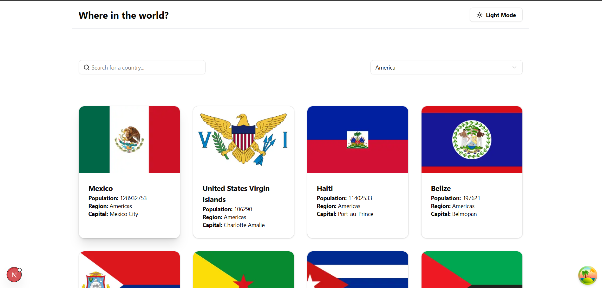

# Frontend Mentor - REST Countries API with color theme switcher solution

This is a solution to the [REST Countries API with color theme switcher challenge on Frontend Mentor](https://www.frontendmentor.io/challenges/rest-countries-api-with-color-theme-switcher-5cacc469fec04111f7b848ca). Frontend Mentor challenges help you improve your coding skills by building realistic projects. 

## Table of contents

- [Overview](#overview)
  - [The challenge](#the-challenge)
  - [Screenshot](#screenshot)
  - [Links](#links)
- [My process](#my-process)
  - [Built with](#built-with)
  - [What I learned](#what-i-learned)
  - [Continued development](#continued-development)
  - [Useful resources](#useful-resources)
- [Author](#author)
- [Acknowledgments](#acknowledgments)

**Note: Delete this note and update the table of contents based on what sections you keep.**

## Overview
This App is build with Next.js and @tanstack/react-query and axios for handle the api 

### The challenge

Users should be able to:

- See all countries from the API on the homepage
- Search for a country using an `input` field
- Filter countries by region
- Click on a country to see more detailed information on a separate page
- Click through to the border countries on the detail page
- Toggle the color scheme between light and dark mode *(optional)*

### Screenshot



Add a screenshot of your solution. The easiest way to do this is to use Firefox to view your project, right-click the page and select "Take a Screenshot". You can choose either a full-height screenshot or a cropped one based on how long the page is. If it's very long, it might be best to crop it.

Alternatively, you can use a tool like [FireShot](https://getfireshot.com/) to take the screenshot. FireShot has a free option, so you don't need to purchase it. 

Then crop/optimize/edit your image however you like, add it to your project, and update the file path in the image above.

**Note: Delete this note and the paragraphs above when you add your screenshot. If you prefer not to add a screenshot, feel free to remove this entire section.**

### Links

- Solution URL: [Add solution URL here](https://github.com/abdallemad/Restfy-Countries-api-front-end-mentor)
- Live Site URL: [Add live site URL here](https://restfy-countries-api.vercel.app/)

## My process

1. first build a structure for the entier app 
2. structure the component
3. grab the data from the api 
3. add filter options with the searchparams
4. add loading skeletons 
5. add cach with react-query by using queryKeys

### Built with

- @tanstack/react-query
- tailwindcss
- axios
- [React](https://reactjs.org/) - JS library
- [Next.js](https://nextjs.org/) - React framework
- [shadcn-ui](https://shadcn.com) - For UI liber


### What I learned

- learned to use Debouncing with React query and Next.js
- learned to use react-query for cach the result 
- learn to use server actions with next.js to filter the results by name to enhance the performance

To see how you can add code snippets, see below:

```jsx
function useGetAllCountries() {
  const searchparams = useSearchParams();
  const name = searchparams.get("q") || "";
  const region = searchparams.get("region") || "";
  const { data, isLoading, isError } = useQuery({
    queryKey: ["countries", `${region || "america"}`, name],
    queryFn: async () => {
      try {
        const  data  = await getAllCountries({ name, region });
        return data
      } catch (error) {
        throw new Error("Error fetching countries");
      }
    },
  });
  return {
    data,
    isLoading,
    isError,
  };
}
```

### Continued development

Use this section to outline areas that you want to continue focusing on in future projects. These could be concepts you're still not completely comfortable with or techniques you found useful that you want to refine and perfect.

**Note: Delete this note and the content within this section and replace with your own plans for continued development.**

### Useful resources

- [Next.js](https://nextjs.org/docs) - Next.js Documentation
- [Shadcn ui theme](https://ui.shadcn.com/docs/dark-mode/next) - for set up the dark theme easily 

## Author

- Website - [Abdalla Emad](https://abdallahemad.vercel.app)
- Frontend Mentor - [@abdallaemad](https://www.frontendmentor.io/profile/abdallemad)
- Linked In - [@abdallah-emad](https://www.linkedin.com/in/abdalla-emad-618b8b317/)

## Acknowledgments

This is where you can give a hat tip to anyone who helped you out on this project. Perhaps you worked in a team or got some inspiration from someone else's solution. This is the perfect place to give them some credit.

